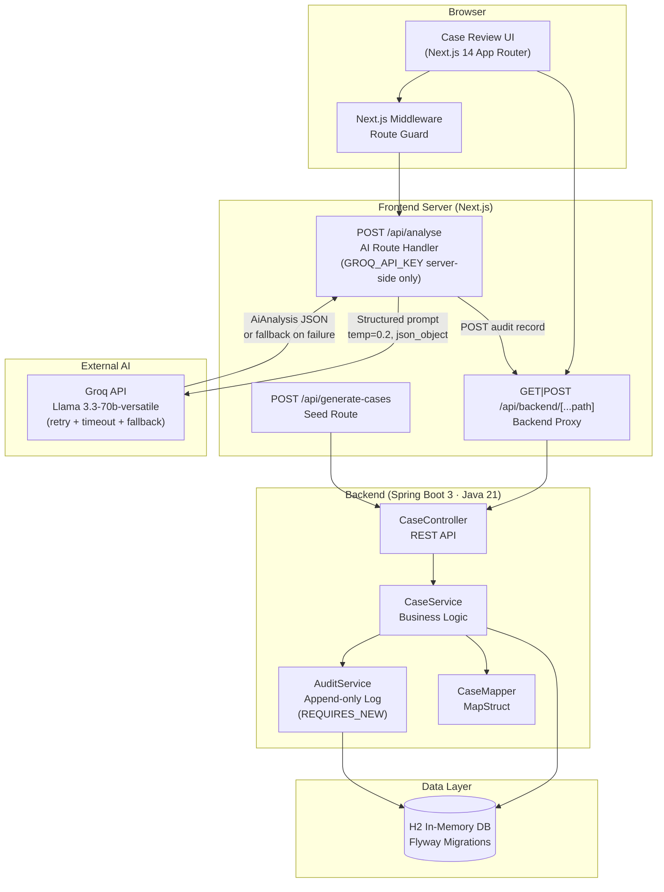

# BankOps Agent Console

> **AI-assisted customer case review for banking operations.**  
> A trainee project demonstrating Java + TypeScript + AI orchestration in a financial-sector context.

---

## Overview

BankOps Agent Console is a full-stack application that simulates how an AI agent can assist human bank operators in reviewing flagged customer cases (fraud alerts, KYC reviews, AML flags, credit limit requests).

The system embodies the "human-in-the-loop" principle central to responsible AI in financial services: **the AI analyses and recommends; the human decides**.

---

## Architecture



---

## Key Design Decisions

| Decision | Rationale |
|---|---|
| Java backend acts as "legacy surface" | Demonstrates ability to work with existing banking systems rather than rewriting them |
| AI orchestration lives server-side (Next.js Route Handler) | API key never reaches the browser; all LLM calls are proxied |
| Groq + Llama 3.3-70b | Free tier, OpenAI-compatible, fast inference suitable for demos |
| AI resilience: retry + timeout + fallback | If Groq is unavailable, the system degrades gracefully to manual review mode rather than crashing |
| Flyway schema migrations | Production-grade database lifecycle management |
| MapStruct for DTO mapping | Compile-time generated, zero reflection – performance and safety |
| `REQUIRES_NEW` on audit writes | Audit entries persist even if the main transaction rolls back |
| RFC 7807 Problem Detail errors | Structured, machine-readable error responses |
| Polling every 30 s | Simple real-time feel without WebSocket complexity for a demo |
| CI/CD via GitHub Actions | Every push runs lint, type-check, tests, and build for both services |
| PostgreSQL on Railway | Production uses PostgreSQL; H2 is used locally for zero-config dev setup |

---

## Tech Stack

### Backend (Java 21 + Spring Boot 3)
- **Spring Boot 3.2** – REST API, validation, JPA
- **H2** – in-memory database (local development)
- **PostgreSQL** – production database (Railway)
- **Flyway** – schema versioning and seed data
- **Lombok** – boilerplate reduction
- **MapStruct** – compile-time DTO mapping

### Frontend (TypeScript + Next.js 14)
- **Next.js 14** (App Router) – SSR, Route Handlers, rewrites
- **Tailwind CSS** – utility-first dark-mode UI
- **Groq SDK** – AI inference (Llama 3.3-70b-versatile, free tier)
- **Lucide React** – icon set

### Infrastructure
- **GitHub Actions** – CI pipeline (lint → type-check → test → build on every push)

---

## Getting Started

### Prerequisites
- Java 21+
- Node.js 20+
- Maven 3.9+
- A free [Groq API key](https://console.groq.com)

### 1. Start the Java backend

```bash
cd backend
./mvnw spring-boot:run
# Runs on http://localhost:8080
# H2 console: http://localhost:8080/h2-console
```

### 2. Configure the frontend

```bash
cd frontend
cp .env.local.example .env.local
# Edit .env.local and add your GROQ_API_KEY
```

### 3. Start the frontend

```bash
cd frontend
npm install
npm run dev
# Runs on http://localhost:3000
```

---

## Project Structure

```
bankops-agent-console/
├── backend/                          # Java Spring Boot
│   ├── pom.xml
│   └── src/main/
│       ├── java/fi/cgi/bankops/
│       │   ├── BankOpsApplication.java
│       │   ├── audit/
│       │   │   └── AuditService.java          # Append-only audit log
│       │   ├── config/
│       │   │   ├── CorsProperties.java        # Type-safe config
│       │   │   └── WebConfig.java             # CORS setup
│       │   ├── controller/
│       │   │   └── CaseController.java        # REST endpoints
│       │   ├── dto/                           # API contracts (records)
│       │   ├── exception/                     # Domain exceptions + handler
│       │   ├── model/                         # JPA entities + enums
│       │   ├── repository/                    # Spring Data JPA
│       │   └── service/
│       │       ├── CaseService.java           # Business logic
│       │       └── CaseMapper.java            # MapStruct mapper
│       └── resources/
│           ├── application.yml
│           └── db/migration/
│               └── V1__init_schema.sql        # Flyway migration + seed data
│
└── frontend/                         # TypeScript Next.js
    ├── next.config.js                          # Proxy rewrites
    ├── tailwind.config.ts
    └── src/
        ├── app/
        │   ├── layout.tsx
        │   ├── page.tsx                        # Main dashboard (client)
        │   └── api/
        │       └── analyse/
        │           └── route.ts               # AI agent (server-side)
        ├── components/
        │   ├── agent/
        │   │   ├── AiPanel.tsx                # AI analysis display
        │   │   └── DecisionPanel.tsx          # Human decision form
        │   ├── layout/
        │   │   └── Navbar.tsx
        │   └── ui/
        │       ├── AuditTimeline.tsx          # Chronological audit trail
        │       ├── Badge.tsx
        │       ├── CaseCard.tsx               # Case list item
        │       └── Spinner.tsx
        ├── hooks/
        │   └── useCases.ts                    # All dashboard state
        ├── lib/
        │   ├── api.ts                         # Client-side API calls
        │   ├── serverApi.ts                   # Server-side API calls
        │   └── utils.ts                       # Helpers + colour maps
        └── types/
            └── index.ts                       # All domain types
```

---

## REST API Reference

| Method | Path | Description |
|--------|------|-------------|
| `GET`  | `/api/v1/cases/active` | All pending/under-review cases, priority-ordered |
| `GET`  | `/api/v1/cases/{id}` | Single case by ID |
| `GET`  | `/api/v1/cases/{id}/audit` | Full audit trail for a case |
| `POST` | `/api/v1/cases/{id}/ai-analysis` | Record AI agent analysis |
| `POST` | `/api/v1/cases/{id}/decision` | Submit operator decision |
| `GET`  | `/api/v1/cases/health` | Health check |

All error responses follow [RFC 7807 Problem Detail](https://www.rfc-editor.org/rfc/rfc7807).

---

## AI Agent

The AI agent is a Next.js Route Handler (`POST /api/analyse`) that:

1. Receives a `CustomerCase` object from the client
2. Builds a structured prompt with case metadata
3. Calls Groq's Llama 3.3-70b with `temperature=0.2` and `response_format: json_object`
4. Validates the structured JSON response
5. Posts the analysis to the Java backend's audit log
6. Returns the analysis to the frontend for display

The agent deliberately operates with low temperature to produce consistent, factual output appropriate for a compliance context.

---

## Security Considerations

- GROQ_API_KEY is a server-side secret; never sent to the browser
- CORS is explicitly configured and environment-driven
- All inputs are validated (Jakarta Validation on backend, TypeScript types on frontend)
- Audit log uses `REQUIRES_NEW` propagation – records survive transaction rollbacks
- Decision rationale is mandatory (minimum 10 characters) – enforces accountability
- Terminal case states are immutable – no re-decision after closure
- Error responses never expose stack traces to clients

---

## Author

**TheoQQQQ** · [github.com/TheoQQQQ](https://github.com/TheoQQQQ)

Built for Jukka and Tommi.
